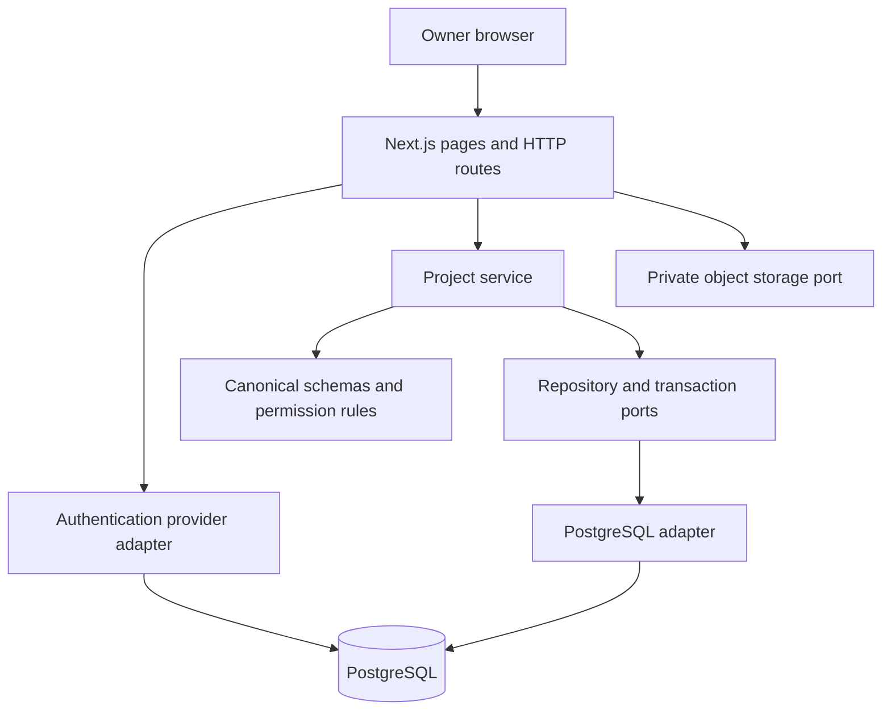
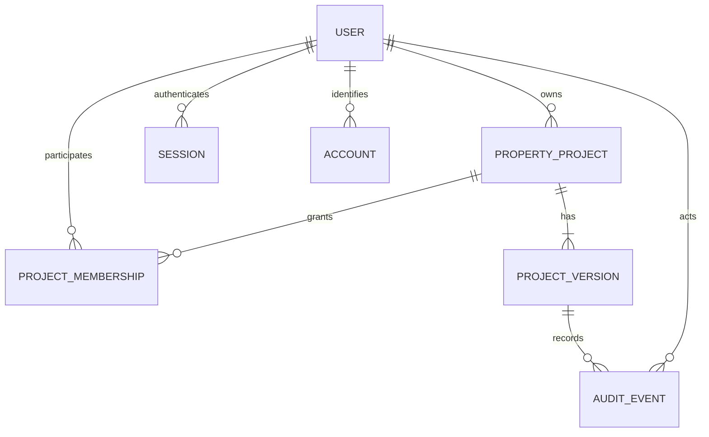

# Phase 1 architecture

## Decision: a modular monolith

One Next.js Node application deploys the UI and HTTP API. Domain/services do not import React, Next.js, PostgreSQL, or Better Auth. PostgreSQL and auth/storage adapters implement ports. ESLint rejects key dependency inversions. There is no separate empty API application or collection of unused feature packages.

Server-rendered pages use the same authorized service methods as API handlers. Cookie/session objects remain at the adapter boundary; application services receive only an authenticated `Principal { userId }`. A future API process or worker can compose these services without rewriting business logic. Domain calculations will be added to separate modules only as their phase introduces meaningful ownership.

## Canonical project and versions

`property_projects` is the stable root: UUID, immutable owner, creation time, and current revision. Project facts live in `project_versions.snapshot`, validated against an explicit schema version. Phase 1 facts are name, independent residential type, and active/archived status. No land, requirements, or other future feature state is invented.

The current pointer is a deferred composite foreign key `(project_id, current_revision)`. It cannot reference another project's version or a missing version. Version UUIDs and `(project_id, revision)` are unique. Audit records have a composite project/version foreign key. Database triggers reject history/audit modification, owner reassignment, and revision jumps. Application roles cannot confer OWNER: ownership comes only from `owner_user_id`, and owner membership rows are forbidden.

Updates require `expectedRevision` and a human change reason. A transaction locks the project identity, rereads the current snapshot, authorizes the role, checks revision, validates the new snapshot, appends a version, advances the pointer, and inserts audit before commit. Stale clients receive 409. A no-op creates no spurious version. Access mutations take the same project lock, so concurrent writes and revocation share an ordering point. Membership changes are audited against the active version but do not create a property-data revision. Read requests can finish if already in flight when access is revoked; subsequent requests recheck the database.

Audit events preserve actor, action, time, before/after, source, project and version. Current writes are HUMAN only; clients cannot set source or owner. AI/SYSTEM provenance is reserved at the schema boundary but has no implementation. Professional approval is a later explicit workflow, not implied by reading a version or assigning PROFESSIONAL.

## Permissions and data projection

| Role | Summary | Versions | Edit metadata / archive | Manage access |
| --- | --- | --- | --- | --- |
| OWNER | Yes | Yes | Yes | Yes |
| PROFESSIONAL | Yes | Yes | No | No |
| CONTRACTOR_VIEWER | Yes | No | No | No |
| CONTRACTOR_CONTRIBUTOR | Yes | No | No | No |

Contributor task/diary/delivery rights arrive with those domains. There are no unrelated global roles. Inaccessible project IDs return the same 404 as missing IDs. Authorized members requesting a disallowed operation receive 403. General project responses are explicit allowlists, not serialized aggregates. Future private notes/financial data must never be added to these summary responses. Before snapshots contain role-sensitive planning fields, version access must get its own approved-field projection; the current professional history access covers only Phase 1 metadata.

The access settings use existing stable account IDs. There is no email invitation workflow or public directory. Email is currently unverified; it is never used as proof of a person's identity or authorization to a project.

## Authentication and HTTP

Better Auth supplies email/password hashing, signed opaque cookies, database sessions, and persistent authentication rate limits. Cookie caching is disabled for immediate revocation. The adapter projects to internal user IDs. Auth tables use UUID IDs and have provider/account identity uniqueness. Replacing the provider must preserve internal user IDs and account mappings.

Only implemented auth endpoints are exposed: sign-up, sign-in, sign-out, get-session. No account deletion, account linking, arbitrary profile update, or email-changing route is forwarded. Mutation requests enforce exact origin, reject cross-site fetch metadata, require JSON, and cap bodies at 16 KiB before parsing. Validation rejects unknown domain fields. Auth passwords are 12–128 characters at registration. Error envelopes carry a request ID, omit internals, and private API responses are `no-store`. Database queries are parameterized.

Production requires HTTPS, secure cookies, a strong secret, and a trusted client-IP proxy. The local adapter uses the loopback identity for auth throttling. The development server is not intended to be internet accessible. No homegrown password cryptography is used.

## Persistence and operations

SQL migrations are ordered, transactional, checksum-tracked, and serialized using an advisory lock. An edited applied migration is rejected. Migrations have their own package entry point and do not enter the application bundle. Runtime uses a bounded connection pool with statement and connection timeouts. Migrations execute as an explicit deployment operation, not a request side effect.

Application authorization is currently the isolation boundary; PostgreSQL RLS is not enabled. Do not expose direct SQL access to tenants. Use a restricted runtime role and separate migration role in deployment. Append-only triggers protect against accidental application writes; a database administrator can still alter the database. This is not tamper-evident archival storage.

## Storage and future jobs

`ObjectStorage` defines put/get/delete of opaque objects. The implemented local adapter creates private files, generates UUID keys, limits size, returns SHA-256 metadata, does not overwrite files, rejects traversal, and refuses symlink reads. It is an internal primitive; it does not grant project access or expose a download URL. No upload endpoint exists in Phase 1.

`JobQueue`, typed `JobRequest`, and `ProjectVersionReference` are contracts only. There is no fake queue, worker, payment path, or generated output. When a real job is introduced, enqueue through a durable transactional outbox; include actor, idempotency key, and exact version reference. Payment gating, retries, cancellation, job persistence, and artifact validation belong to the deliverable phase. Nothing in Phase 1 runs a costly job.

## Extension rules

- Phase 2 adds typed site/land data and attachment records, with relational `(project_id, version_id)` provenance. New schema versions require explicit readers/upcasters; never rewrite historical snapshots in place.
- Future site boundaries must admit polygons with coordinate reference systems and explicit units. Do not embed rectangular assumptions in project identity. Add PostGIS only at the geometry repository boundary when spatial queries justify it.
- Requirements, design, deterministic evaluations, financial records and construction will reference the same project. Stable child IDs and explicit relationships are mandatory; display names never identify rooms, materials, or work items.
- Generated documents/artifacts consume canonical versioned state. They do not introduce a competing project model.
- A future digital twin job consumes a validated building specification derived from a specific project version. Geometry, components, GLB/glTF, interactive viewing, and print processing are intentionally unimplemented. No invented DSL schema or pseudo-engine is committed in Phase 1.

## References used during implementation

- [Next.js installation and independent linting](https://nextjs.org/docs/app/getting-started/installation)
- [Better Auth database and identity model](https://better-auth.com/docs/concepts/database)
- [Better Auth session management](https://better-auth.com/docs/concepts/session-management)
- [Better Auth persistent rate limits and trusted proxy requirements](https://better-auth.com/docs/concepts/rate-limit)
- [PostgreSQL constraints](https://www.postgresql.org/docs/17/ddl-constraints.html)
